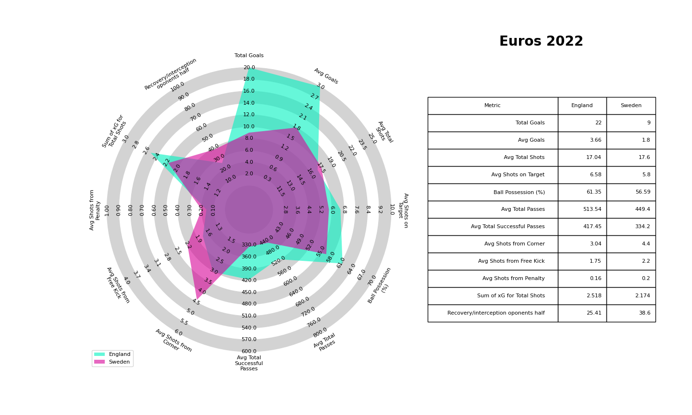

# SportsAnalytics-project
Project in the course Sports Analytics

[Link to the report](https://docs.google.com/document/d/1Gipro1lEUQog7wbXnazbFTLQlMaZlAnTznP7ucclldw/edit?usp=sharing)

# Installation 
- pip install mplsoccer
- pip install statsbombpy
- pip install pandas

# Country id
- Sweden Women's id: 220
- England Women's id: 68
- Spain Women's id: 214
- Germany Women's id: 85
- United States Women's id: 241
- Netherlands Women's id: 160

#  Match id for World Cup 23
- Competition id: 72
- Season id: 107
## Sweden
- South africa: 3893796
- Argentina: 3893830
- Japan: 3902239
- USA: 3901797
- Italy: 3893814
- Spain: 3904628
- Australia: 3906389

## England
- China: 3893828
- Haiti: 3893794
- Denmark: 3893811
- Nigeria: 3901735
- Colombia: 3902967
- Australia: 3904629
- Spain: 3906390

## Spain
- Costa rica: 3893791
- Switzerland: 3901733
- Netherlands:3902240
- Japan: 3893822
- Zambia: 3893806
- Sweden: 3904628
- England: 3906390

#  Match id for Euro 22
- Competition id: 53
- Season id: 106
## Sweden
- Switzerland: 3835331
- Netherlands: 3835324
- England: 3845506
- Belgium: 3844386
- Portugal: 3835340

## England
- Spain: 3844384
- Germany: 3847567
- Sweden: 3845506
- Northen ireland: 3835335
- Norway: 3835327
- Austria: 3835319

## Germany
- England: 3847567
- France: 3845507
- Austria: 3844385
- Finland: 3835338
- Spain: 3835330
- Denmark: 3835322

#  Match id for World Cup 19
- Competition id: 72
- Season id: 30
## Sweden
- Chile: 22944
- USA: 68345
- Canada: 69163
- England: 69301
- Germany: 69208
- Thailand: 22973
- Netherlands: 69284

## Netherlands
- Cameroon: 22964
- Canada: 68344
- USA: 69321
- New Zealand: 22942
- Japan: 69188
- Sweden: 69284
- Italy: 69205

## USA
- Thailand: 22943
- Sweden: 68345
- Chile: 22974
- Netherlands: 69321
- France: 69202
- England: 69258
- Spain: 69161

